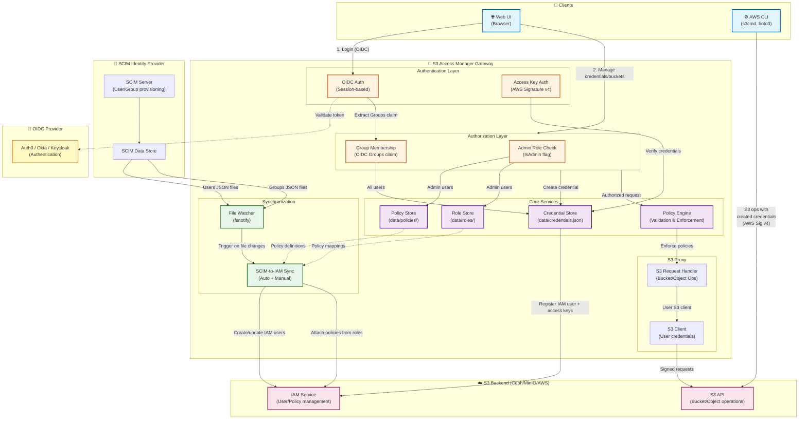

# 🔐 S3 Access Manager

[](https://github.com/HarryKodden/S3-Access-Manager/actions) [](https://goreportcard.com/report/github.com/HarryKodden/S3-Access-Manager) [](LICENSE) [](https://github.com/HarryKodden/S3-Access-Manager/releases) [](https://github.com/HarryKodden/S3-Access-Manager/pkgs/container/s3-gateway)

**Secure, policy-based S3 gateway with OIDC authentication, credential delegation, and web management UI.**

[Features](#features) • [Quick Start](#quick-start) • [Documentation](docs/README.md) • [Contributing](CONTRIBUTING.md)

## Features

- 🔐 **OIDC Authentication**: Auth0, Okta, Azure AD, Keycloak, Google Identity
- 👥 **RBAC (Role-Based Access Control)**: Admin vs User roles with different permissions
- 🌐 **Web Management UI**: Modern interface for credential/bucket/policy management
- 🎯 **Group-Based Access Control**: Map OIDC claims to S3 policies
- 🔄 **Automatic SCIM Sync**: File watcher triggers IAM sync on SCIM data changes
- 🔑 **Self-Service Credentials**: Users create S3 access keys with delegated policies
- 🛡️ **Policy-Based Permissions**: Fine-grained access control with custom policies
- 📊 **Dual Policy Sources**: Built-in + user-created policies
- 🌐 **S3 Browser**: Visual file management with upload/download
- 📈 **Prometheus Metrics**: Built-in monitoring endpoint
- 🐳 **Docker Ready**: Complete containerization
- 🏗️ **AWS CLI Backend**: AWS S3 integration with CLI-based operations
- 🧪 **Integration Tests**: Automated E2E testing with OIDC simulation

## Architecture



### Component Overview

**Authentication & Authorization:**
- **OIDC Auth**: Web UI users authenticate via external OIDC provider, session-based
- **Access Key Auth**: CLI users authenticate with AWS Signature v4 (access/secret keys)
- **RBAC**: Admin role (IsAdmin flag) manages policies/roles; users limited to their groups

**Core Services:**
- **Policy Engine**: Validates S3-only policies, enforces access control
- **Credential Store**: Manages user-created S3 credentials (data/credentials.json)
- **Policy Store**: Stores admin-created custom policies (data/policies/)
- **Role Store**: Maps SCIM groups to S3 policies (data/roles/)

**SCIM Integration:**
- **File Watcher**: Monitors SCIM data directories (data/Users, data/Groups) for changes
- **Sync Service**: Automatically syncs SCIM users/groups to S3 IAM users/policies
- **Debouncing**: 2-second delay to batch rapid SCIM updates

**S3 Operations:**
- **S3 Handler**: Processes bucket/object operations, enforces policies
- **S3 Client**: Creates user-specific S3 clients with delegated credentials
- **Backend**: Ceph/MinIO/AWS S3 with IAM for user/policy management

## Quick Start

### Prerequisites
- Docker & Docker Compose
- OIDC provider (Auth0, Okta, Azure AD, Keycloak, etc.)
- S3 backend (MinIO, AWS S3, CEPH)

### Setup

1. **Clone and configure:**
```bash
git clone https://github.com/HarryKodden/S3-Access-Manager.git
cd S3-Access-Manager
cp config.example.yaml config.yaml
cp .env.example .env
```

2. **Configure environment variables (.env):**
```bash
# OIDC
OIDC_ISSUER=https://your-oidc-provider.com
OIDC_CLIENT_ID=your-client-id
OIDC_CLIENT_SECRET=your-client-secret

# S3 Backend
S3_ENDPOINT=https://s3.amazonaws.com
S3_REGION=us-east-1

# IAM Admin Credentials (for user/policy management)
IAM_ACCESS_KEY=your-admin-access-key
IAM_SECRET_KEY=your-admin-secret-key
```

3. **Configure S3 backend in config.yaml:**
```yaml
s3:
  endpoint: "${S3_ENDPOINT}"
  region: "${S3_REGION}"
  iam:
    access_key: "${IAM_ACCESS_KEY}"
    secret_key: "${IAM_SECRET_KEY}"
```

4. **Define policies in policies/ directory:**
```bash
mkdir -p policies
# Create policy files like admin.json, developer.json
```

### Running

```bash
docker compose up -d --build
```

Access at `http://localhost`:
- Web UI for credential/bucket management
- API endpoints: `/settings/*`, `/s3/*`, `/health`, `/metrics`

## Backend Support

### Supported Backend
- ✅ **AWS CLI**: AWS S3 with CLI-based user and policy management

### Configuration
The gateway uses AWS CLI for backend operations. Configure IAM credentials for admin operations.

## Documentation

- 📘 **[Quick Reference](QUICKREF.md)** - Essential commands and workflows
- 📖 **[Complete User Guide](docs/USAGE_GUIDE.md)** - Detailed usage instructions
- 🔧 **[API Reference](docs/API.md)** - REST API documentation
- 🔐 **[OIDC Setup](docs/OIDC_AUTHENTICATION.md)** - Authentication configuration
- 📋 **[Policy Guide](docs/POLICIES.md)** - Policy syntax and examples

## Policy Configuration

**Important:** All policies must contain **ONLY S3 actions** (s3:*). IAM, EC2, and other service actions are prohibited for security.

### Policy Sources
1. **Built-in Policies** (`policies/`): Pre-defined, deployed with gateway
   - `Read-Only.json` - S3 read operations (Get, List)
   - `Read-Write.json` - S3 read + write operations (Get, Put, Delete, Create)
   - `admin.json` - Full S3 access (s3:*)
2. **User-Created Policies** (`data/policies/`): Created via web UI by admins

### Example S3-Only Policy
```json
{
  "Version": "2012-10-17",
  "Statement": [
    {
      "Sid": "S3BucketAccess",
      "Effect": "Allow",
      "Action": [
        "s3:GetObject",
        "s3:PutObject",
        "s3:ListBucket"
      ],
      "Resource": [
        "arn:aws:s3:::my-bucket",
        "arn:aws:s3:::my-bucket/*"
      ]
    }
  ]
}
```

**Validation:** The gateway automatically validates policies and rejects any containing non-S3 actions:
```json
// ❌ REJECTED - IAM actions not allowed
{
  "Action": ["iam:ListUsers", "s3:GetObject"]
}

// ✅ ACCEPTED - S3 actions only
{
  "Action": ["s3:GetObject", "s3:PutObject"]
}
```

## Usage

### Authentication Flow

**Web UI Users (OIDC):**
1. User logs in via OIDC provider
2. Gateway validates token and extracts `Groups` claim
3. Groups must match SCIM-provisioned groups
4. User creates S3 credentials via Web UI
5. Credentials inherit policies from user's groups
6. Gateway creates IAM user in Ceph backend
7. User receives access key + secret key for offline use

**Offline AWS CLI Users (Access Keys):**
1. User configures AWS CLI with credentials from Web UI
2. Commands sent directly to Ceph endpoint (`https://object-acc.data.surf.nl`)
3. Ceph enforces policies attached to IAM user
4. **S3 operations:** ✅ Allowed (based on policies)
5. **IAM operations:** ❌ Denied (credentials are S3-only)

### Managing Credentials

**Via Web UI (Recommended):**
1. Login at `http://localhost:9000`
2. Navigate to **Credentials** tab
3. Click **+ New Credential**
4. Enter name and select groups
5. **Copy access key and secret key immediately** (secret shown once!)
6. Configure AWS CLI with provided credentials

**Via API:**
```bash
# Create credential
curl -X POST http://localhost:9000/settings/credentials \
  -H "Authorization: Bearer TOKEN" \
  -H "Content-Type: application/json" \
  -d '{"name": "my-s3-access", "groups": ["developer-group"]}'

# List credentials
curl http://localhost:9000/settings/credentials \
  -H "Authorization: Bearer TOKEN"
```

### Using S3 Credentials with AWS CLI

**Setup AWS CLI:**
```bash
# Configure profile
aws configure --profile myprofile
# AWS Access Key ID: <from gateway>
# AWS Secret Access Key: <from gateway>
# Default region: us-east-1
# Default output: json

# Add endpoint to ~/.aws/config
[profile myprofile]
region = us-east-1
endpoint_url = https://object-acc.data.surf.nl
s3 =
  signature_version = s3v4
  addressing_style = path
```

**S3 Operations (Work ✅):**
```bash
# List buckets
aws --profile myprofile s3 ls

# Create bucket
aws --profile myprofile s3 mb s3://mybucket

# Upload file
aws --profile myprofile s3 cp myfile.txt s3://mybucket/

# List objects
aws --profile myprofile s3 ls s3://mybucket

# Download file
aws --profile myprofile s3 cp s3://mybucket/myfile.txt ./downloaded.txt

# Delete file
aws --profile myprofile s3 rm s3://mybucket/myfile.txt

# Remove bucket
aws --profile myprofile s3 rb s3://mybucket
```

**IAM Operations (Fail ❌):**
```bash
# These commands will fail with authorization errors
aws --profile myprofile iam list-users
aws --profile myprofile iam create-user --user-name newuser
aws --profile myprofile iam create-group --group-name newgroup

# Error: User is not authorized to perform: iam:*
```

**Why IAM Commands Fail:** User credentials are intentionally restricted to S3-only operations for security. IAM management (creating users, groups, policies) is performed by administrators through the gateway's Web UI and SCIM provisioning.

### Administrator Tasks

**Manage Policies (Web UI):**
1. Login as admin (email configured in `.env` `ADMIN` variable)
2. Navigate to **Policies** tab
3. Create/Edit/Delete policies (S3 actions only)
4. Gateway validates and rejects non-S3 actions

**Manage Groups (SCIM):**
- Groups are provisioned via SCIM API (external system)
- Groups stored in `/data/Groups/`
- Gateway reads SCIM groups and matches to OIDC Groups claim
- Admins attach policies to SCIM groups via Web UI

## Web Frontend

Modern interface at `http://localhost`:

- **Authentication**: OIDC login with admin/regular user roles
- **Credentials**: Self-service creation with policy delegation
- **Buckets**: Visual browser with upload/download
- **Policies**: View (users) or manage (admins)
- **Admin Mode**: Toggle to test regular user experience

## Development

```bash
# Install dependencies
go mod download

# Run tests
go test ./...

# Build
make build

# Run locally
./s3-gateway -config config.yaml
```

### Integration Testing

```bash
# Start services
docker compose up -d

# Run tests
./demo-flow.sh

```

## License

MIT