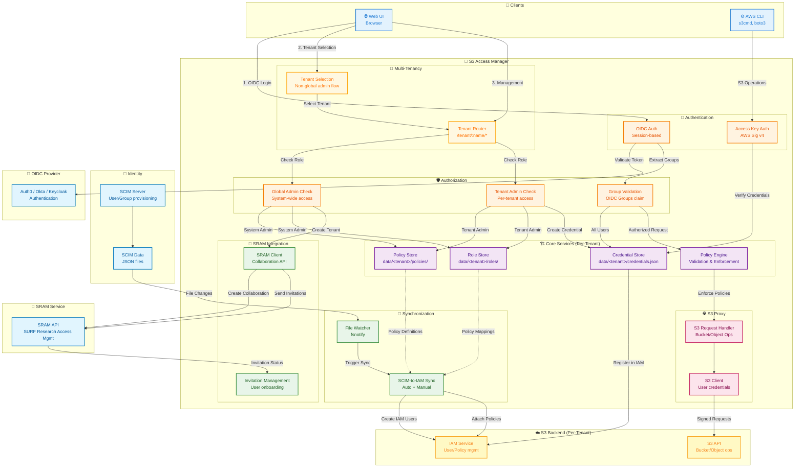

# 🔐 S3 Access Manager

[](https://github.com/HarryKodden/S3-Access-Manager/actions) [](https://goreportcard.com/report/github.com/HarryKodden/S3-Access-Manager) [](LICENSE) [](https://github.com/HarryKodden/S3-Access-Manager/releases) [](https://github.com/HarryKodden/S3-Access-Manager/pkgs/container/s3-gateway)

**Secure, policy-based S3 gateway with OIDC authentication, credential delegation, and web management UI.**

[Features](#features) • [Quick Start](#quick-start) • [Documentation](docs/README.md) • [Contributing](CONTRIBUTING.md)

## Features

- 🔐 **OIDC Authentication**: Auth0, Okta, Azure AD, Keycloak, Google Identity
- 👥 **Multi-Tenant RBAC**: Global admins, tenant admins, and users with hierarchical permissions
- 🏢 **Multi-Tenancy Support**: Complete isolation between tenants with separate credentials, policies, and configurations
- 🌐 **Web Management UI**: Modern interface for tenant, credential, bucket, and policy management
- 🎯 **Group-Based Access Control**: Map OIDC claims to S3 policies
- 🔄 **Automatic SCIM Sync**: File watcher triggers IAM sync on SCIM data changes
- 🤝 **SRAM Integration**: SURF Research Access Management for collaboration and user invitations
- 🔑 **Self-Service Credentials**: Users create S3 access keys with delegated policies
- 🛡️ **Tenant-Specific Permissions**: Tenant admins manage their tenant; users limited to their groups
- 📋 **Policy-Based Permissions**: Fine-grained access control with custom policies
- 🌐 **S3 Browser**: Visual file management with upload/download
- 📈 **Prometheus Metrics**: Built-in monitoring endpoint
- 🐳 **Docker Ready**: Complete containerization
- 🏗️ **AWS CLI Backend**: AWS S3 integration with CLI-based operations
- 🧪 **Integration Tests**: Automated E2E testing with OIDC simulation

## Architecture



### Component Overview

**Authentication & Authorization:**
- **OIDC Auth**: Web UI users authenticate via external OIDC provider, session-based
- **Access Key Auth**: CLI users authenticate with AWS Signature v4 (access/secret keys)
- **Multi-Level RBAC**: 
  - **Global Admins**: Full system access, manage all tenants, create new tenants
  - **Tenant Admins**: Manage specific tenant (policies, roles, users)
  - **Users**: Limited to their assigned groups and credentials

**Multi-Tenancy:**
- **Tenant Router**: Routes requests to specific tenant contexts (`/tenant/:name/*`)
- **Tenant Selection**: Non-global admin users select their tenant on login
- **Tenant Isolation**: Complete separation of credentials, policies, roles, and IAM resources
- **Per-Tenant Configuration**: Each tenant has dedicated IAM credentials and settings

**Core Services (Per-Tenant):**
- **Policy Engine**: Validates S3-only policies, enforces access control
- **Credential Store**: Manages user-created S3 credentials (`data/<tenant>/credentials.json`)
- **Policy Store**: Stores admin-created custom policies (`data/<tenant>/policies/`)
- **Role Store**: Manages group-to-policy mappings (`data/<tenant>/roles/`)

**SRAM Integration (SURF Research Access Management):**
- **Collaboration Creation**: Automatically creates SRAM collaborations for new tenants
- **Invitation Management**: Send and track user invitations to tenant collaborations
- **Auto-Service Connection**: Automatically connects services to collaborations when admins are present but no services are connected
- **Status Tracking**: Monitor invitation acceptance and user onboarding
- **API Integration**: RESTful integration with SRAM platform

**SCIM Integration (Per-Tenant):**
- **File Watcher**: Monitors global SCIM data directories (`data/scim/Users`, `data/scim/Groups`)
- **Sync Service**: Automatically syncs SCIM users/groups to tenant-specific IAM users/policies
- **Debouncing**: 2-second delay to batch rapid SCIM updates
- **Per-Tenant Sync**: Each tenant has isolated IAM resources but shares global SCIM source

**S3 Operations:**
- **S3 Handler**: Processes bucket/object operations, enforces policies
- **S3 Client**: Creates user-specific S3 clients with delegated credentials
- **Backend**: Ceph/MinIO/AWS S3 with IAM for user/policy management
- **Per-Tenant Isolation**: Each tenant uses separate IAM credentials

## Quick Start

### Prerequisites
- Docker & Docker Compose
- OIDC provider (Auth0, Okta, Azure AD, Keycloak, etc.)
- S3 backend (MinIO, AWS S3, CEPH, etc)

### Setup

1. **Clone and configure:**
```bash
git clone https://github.com/HarryKodden/S3-Access-Manager.git
cd S3-Access-Manager
cp config.example.yaml config.yaml
cp .env.example .env
```

2. **Configure environment variables (.env):**
```bash
# OIDC
OIDC_ISSUER=https://your-oidc-provider.com
OIDC_CLIENT_ID=your-client-id
OIDC_CLIENT_SECRET=your-client-secret
OIDC_SCOPES="openid profile email groups"
OIDC_SESSION_CACHE_TTL=15m

# S3 Backend
S3_ENDPOINT=https://s3.amazonaws.com
S3_REGION=us-east-1
S3_FORCE_PATH_STYLE=false

# SCIM (optional)
SCIM_API_KEY=your-scim-api-key

# SRAM (optional)
SRAM_API_URL=https://acc.sram.surf.nl
SRAM_API_KEY=your-sram-api-key
SRAM_ENABLED=true

# Global Admins
GLOBAL_ADMINS=admin@example.com,superadmin@example.com

# IAM credentials are now configured per tenant in data/tenants/<tenant>/config.yaml
# Each tenant requires its own IAM access key and secret key for AWS operations
```

3. **Configure S3 backend in config.yaml:**
```yaml
s3:
  endpoint: "${S3_ENDPOINT}"
  region: "${S3_REGION}"
```

4. **Create tenant configuration in data/tenants/<tenant>/config.yaml:**
```yaml
tenant_admins:
- "admin@example.com"
iam:
  access_key: "your-tenant-iam-access-key"
  secret_key: "your-tenant-iam-secret-key"
```

4. **Policies are managed via the web UI by administrators**

### Running

```bash
docker compose up -d --build
```

Access at `http://localhost`:
- Web UI for credential/bucket management
- API endpoints: `/settings/*`, `/s3/*`, `/health`, `/metrics`

## Backend Support

### Supported Backend
- ✅ **AWS CLI**: AWS S3 with CLI-based user and policy management

### Configuration
The gateway uses AWS CLI for backend operations. Configure IAM credentials for admin operations.

### Multi-Tenant Configuration
The gateway supports multi-tenant deployments where each tenant has isolated users, groups, policies, credentials, and IAM resources. OIDC and SCIM are configured globally and shared across all tenants.

#### Tenant Structure
```
data/
├── scim/                    # Global SCIM data (shared)
│   ├── Groups/              # SCIM group data
│   └── Users/               # SCIM user data
├── <tenant-name>/
│   ├── config.yaml          # Tenant-specific configuration
│   ├── credentials.json     # Tenant user credentials
│   ├── policies/            # IAM policies
│   └── roles/               # Role-to-policy mappings
```

#### Global Configuration (`config.yaml`)
```yaml
# Global OIDC Configuration (shared across all tenants)
oidc:
  issuer: "https://oidc-provider.com"
  client_id: "global-client-id"
  client_secret: "global-client-secret"
  scopes: "openid profile email groups"
  groups_claim: "groups"
  user_claim: "sub"
  email_claim: "email"
  session_cache_ttl: 15m

# Global SCIM Configuration (shared across all tenants)
scim:
  api_key: "global-scim-secret-key"

# SRAM Configuration (SURF Research Access Management)
sram:
  api_url: "https://sram.surf.nl"
  api_key: "your-sram-api-key"
  enabled: true

# Global Administrators (email addresses with full system access)
global_admins:
  - "admin@example.com"

# Global S3 Configuration
s3:
  endpoint: "https://s3.amazonaws.com"
  region: "us-east-1"
  force_path_style: false
```

#### Tenant Configuration (`data/<tenant>/config.yaml`)
```yaml
name: "example-tenant"

# Tenant administrators (email addresses with admin access to this tenant)
tenant_admins:
  - "admin@example-tenant.com"

# Tenant-specific IAM credentials (required per tenant)
iam:
  access_key: "tenant-iam-access-key"
  secret_key: "tenant-iam-secret-key"

# SRAM Collaboration ID (automatically set when tenant is created via UI)
sram_collaboration_id: "collaboration-uuid"
```

#### User Roles & Access Levels

**Global Administrator** (`global_admins` in root config.yaml):
- Full system access
- Create, edit, and delete tenants
- Access all tenant resources
- Manage SRAM collaborations and invitations
- View Tenants management tab
- Not shown Credentials tab at root level

**Tenant Administrator** (`tenant_admins` in tenant config.yaml):
- Manage specific tenant only
- Create, edit, delete policies and roles
- Manage tenant users and credentials
- Cannot create new tenants
- Must select tenant on login
- Shown Policies and Roles tabs only in their tenant

**Regular User**:
- Access assigned tenants based on group membership
- Create and manage own credentials
- View policies and roles
- Upload/download to permitted buckets
- Must select tenant on login
- Shown Credentials tab only

#### Benefits
- **Isolation**: Each tenant has separate credentials, policies, roles, and IAM resources
- **Centralized Identity**: Single OIDC provider and SCIM source for all tenants
- **Security**: Tenant-specific IAM credentials ensure data separation
- **Scalability**: Easy to add/remove tenants without affecting others
- **SRAM Integration**: Automated collaboration creation and invitation management
- **Role-Based Access**: Granular permissions at global, tenant, and user levels
- **Self-Service**: Tenant admins can manage their own resources independently
- **Simplified Management**: Global OIDC and SCIM configuration reduces complexity

## Documentation

- 📘 **[Quick Reference](QUICKREF.md)** - Essential commands and workflows
- 📖 **[Complete User Guide](docs/USAGE_GUIDE.md)** - Detailed usage instructions
- 🔧 **[API Reference](docs/API.md)** - REST API documentation
- 🔐 **[OIDC Setup](docs/OIDC_AUTHENTICATION.md)** - Authentication configuration
- 📋 **[Policy Guide](docs/POLICIES.md)** - Policy syntax and examples

## Policy Configuration

**Important:** All policies must contain **ONLY S3 actions** (s3:*). IAM, EC2, and other service actions are prohibited for security.

### Policy Sources
- **Administrator-Created Policies** (`data/policies/`): Created and managed via web UI by admins

### Example S3-Only Policy
```json
{
  "Version": "2012-10-17",
  "Statement": [
    {
      "Effect": "Allow",
      "Action": [
        "s3:GetObject",
        "s3:PutObject",
        "s3:ListBucket"
      ],
      "Resource": [
        "arn:aws:s3:::my-bucket",
        "arn:aws:s3:::my-bucket/*"
      ]
    }
  ]
}
```

**Validation:** The gateway automatically validates policies and rejects any containing non-S3 actions:
```json
// ❌ REJECTED - IAM actions not allowed
{
  "Action": ["iam:ListUsers", "s3:GetObject"]
}

// ✅ ACCEPTED - S3 actions only
{
  "Action": ["s3:GetObject", "s3:PutObject"]
}
```

## Usage

### Authentication Flow

**Web UI Users (OIDC):**
1. User logs in via OIDC provider
2. Gateway validates token and extracts `Groups` claim
3. Groups must match SCIM-provisioned groups
4. User creates S3 credentials via Web UI
5. Credentials inherit policies from user's groups
6. Gateway creates IAM user in Ceph backend
7. User receives access key + secret key for offline use

**Offline AWS CLI Users (Access Keys):**
1. User configures AWS CLI with credentials from Web UI
2. Commands sent directly to Ceph endpoint (`https://object-acc.data.surf.nl`)
3. Ceph enforces policies attached to IAM user
4. **S3 operations:** ✅ Allowed (based on policies)
5. **IAM operations:** ❌ Denied (credentials are S3-only)

### Managing Credentials

**Via Web UI (Recommended):**
1. Login at `http://localhost:9000`
2. Navigate to **Credentials** tab
3. Click **+ New Credential**
4. Enter name and select groups
5. **Copy access key and secret key immediately** (secret shown once!)
6. Configure AWS CLI with provided credentials

**Via API:**
```bash
# Create credential
curl -X POST http://localhost:9000/settings/credentials \
  -H "Authorization: Bearer TOKEN" \
  -H "Content-Type: application/json" \
  -d '{"name": "my-s3-access", "groups": ["developer-group"]}'

# List credentials
curl http://localhost:9000/settings/credentials \
  -H "Authorization: Bearer TOKEN"
```

### Using S3 Credentials with AWS CLI

**Setup AWS CLI:**
```bash
# Configure profile
aws configure --profile myprofile
# AWS Access Key ID: <from gateway>
# AWS Secret Access Key: <from gateway>
# Default region: us-east-1
# Default output: json

# Add endpoint to ~/.aws/config
[profile myprofile]
region = us-east-1
endpoint_url = https://object-acc.data.surf.nl
s3 =
  signature_version = s3v4
  addressing_style = path
```

**S3 Operations (Work ✅):**
```bash
# List buckets
aws --profile myprofile s3 ls

# Create bucket
aws --profile myprofile s3 mb s3://mybucket

# Upload file
aws --profile myprofile s3 cp myfile.txt s3://mybucket/

# List objects
aws --profile myprofile s3 ls s3://mybucket

# Download file
aws --profile myprofile s3 cp s3://mybucket/myfile.txt ./downloaded.txt

# Delete file
aws --profile myprofile s3 rm s3://mybucket/myfile.txt

# Remove bucket
aws --profile myprofile s3 rb s3://mybucket
```

**IAM Operations (Fail ❌):**
```bash
# These commands will fail with authorization errors
aws --profile myprofile iam list-users
aws --profile myprofile iam create-user --user-name newuser
aws --profile myprofile iam create-group --group-name newgroup

# Error: User is not authorized to perform: iam:*
```

**Why IAM Commands Fail:** User credentials are intentionally restricted to S3-only operations for security. IAM management (creating users, groups, policies) is performed by administrators through the gateway's Web UI and SCIM provisioning.

### Administrator Tasks

**Manage Policies (Web UI):**
1. Login as admin (email configured in `.env` `ADMIN` variable)
2. Navigate to **Policies** tab
3. Create/Edit/Delete policies (S3 actions only)
4. Gateway validates and rejects non-S3 actions

**Manage Groups (SCIM):**
- Groups are provisioned via SCIM API (external system)
- Groups stored in `/data/scim/Groups/`
- Gateway reads SCIM groups and matches to OIDC Groups claim
- Admins attach policies to SCIM groups via Web UI

## Web Frontend

Modern interface at `http://localhost`:

- **Authentication**: OIDC login with admin/regular user roles
- **Tenant Management**: Global admins can create and manage tenants
- **Credentials**: Self-service creation with policy delegation (only shown on tenant pages)
- **Buckets**: Visual browser with upload/download
- **Policies**: View (users) or manage (tenant admins)
- **Roles**: Group-to-policy mappings (tenant admins only)
- **Admin Mode**: Toggle to test regular user experience

## Development

```bash
# Install dependencies
go mod download

# Run tests
go test ./...

# Build
make build

# Run locally
./s3-gateway -config config.yaml
```

### Integration Testing

```bash
# Start services
docker compose up -d

# Run E2E workflow tests
./demo-flow.sh

# Run SRAM integration tests (unit tests)
go test -v ./internal/sram/

# Test SRAM API directly
export SRAM_API_URL=https://your-sram-instance.com
export SRAM_API_KEY=your-api-key
./test-sram-api.sh
```

For comprehensive SRAM integration testing, see [SRAM Testing Guide](docs/SRAM_TESTING_GUIDE.md).

## Documentation

- [API Documentation](docs/API.md) - REST API endpoints and examples
- [Credentials Management](docs/CREDENTIALS.md) - User credential lifecycle
- [OIDC Authentication](docs/OIDC_AUTHENTICATION.md) - OIDC setup and configuration
- [Policies](docs/POLICIES.md) - Policy engine and access control
- [Secure Configuration](docs/SECURE_CONFIG.md) - Production security hardening
- [Usage Guide](docs/USAGE_GUIDE.md) - End-user guide
- [SRAM Testing Guide](docs/SRAM_TESTING_GUIDE.md) - SRAM integration testing


MIT